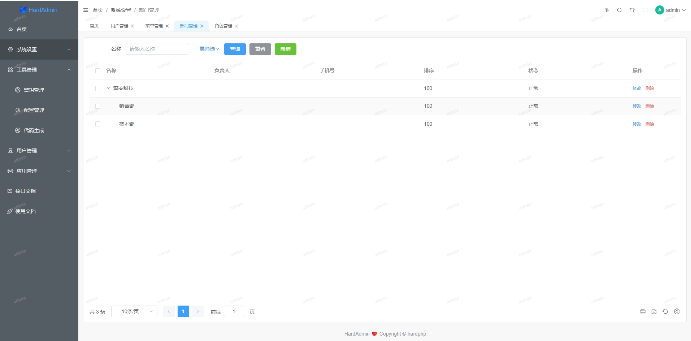
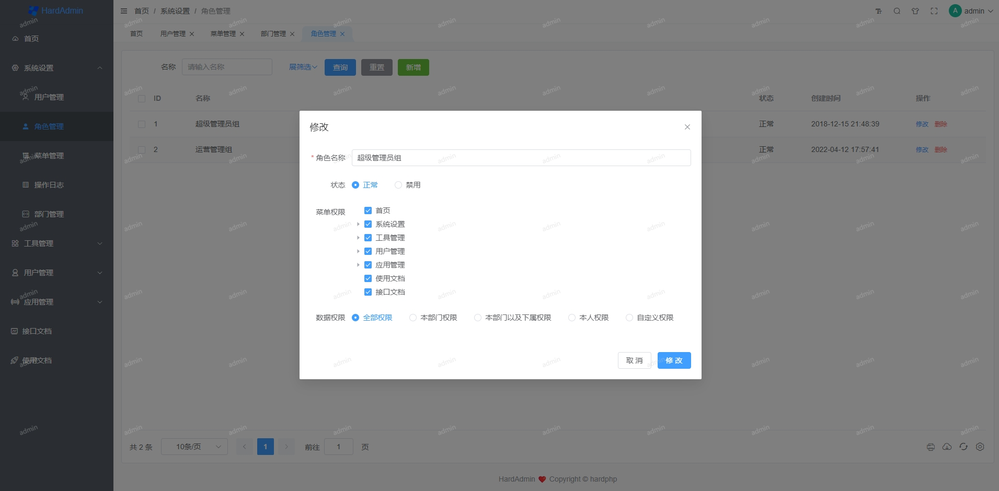
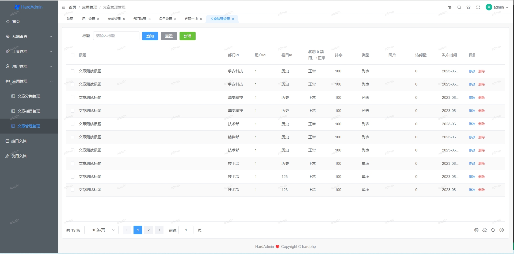
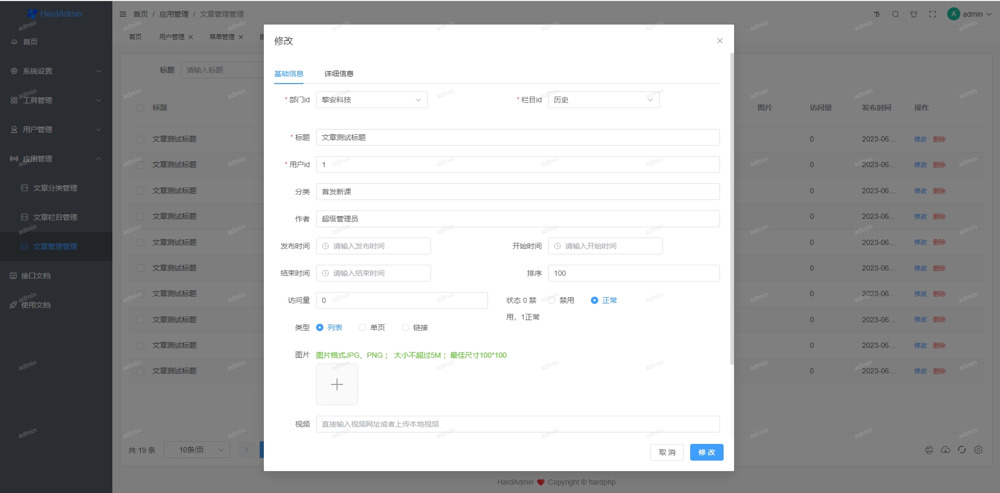

# 介绍

## 项目介绍

&emsp;&emsp;🔥🔥🔥 项目基于[thinkphp6](https://www.thinkphp.cn/)， [vue3.x](https://v3.cn.vuejs.org/) 、[Element plus](https://element-plus.gitee.io/zh-CN/#/zh-CN) 等框架，可用于企业开发的前后端分离解决方案。此项目可免费用于学习研究，免费用于商业使用。

&emsp;&emsp;项目作者目前从事软件定制开发工作，是一个技术热爱者，把在企业项目开发过程中积累的经验，整理成开箱即用的框架，分享给热爱技术同胞们，大家一起交流分享，希望能把框架做的越来月越完善。

&emsp;&emsp;欢迎大家提出建议，一起完善HardAdmin；以及后面开发基于python和go开发语言的WEB前后端分离框架。

## 项目预览

- [HardAdmin在线预览 ](http://test.hardphp.com/backend/#/login)  http://test.hardphp.com/backend/#/login
- 账号：admin
- 密码：123456

## 使用文档

 http://test.hardphp.com/HardAdmin/

## 框架分层
- 1、从下往上主要分为三层：模型层model、逻辑服务层service、控制器层controller
- 2、上层可调用下层，不可下层反向调用上层，逻辑服务层可以平层调用
- 3、分层初衷是封装复用，争取重复代码不写第二遍，此类规范并无绝对标准，重在统一规范

## CRUD代码生成
- 自动生成接口端（model、service、controller、validate ）各层代码，以及前端api、列表、表单代码

## 项目预览

